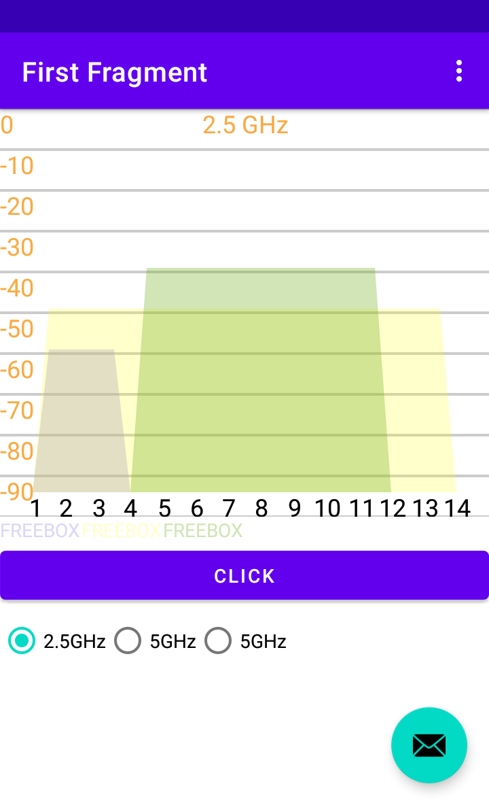
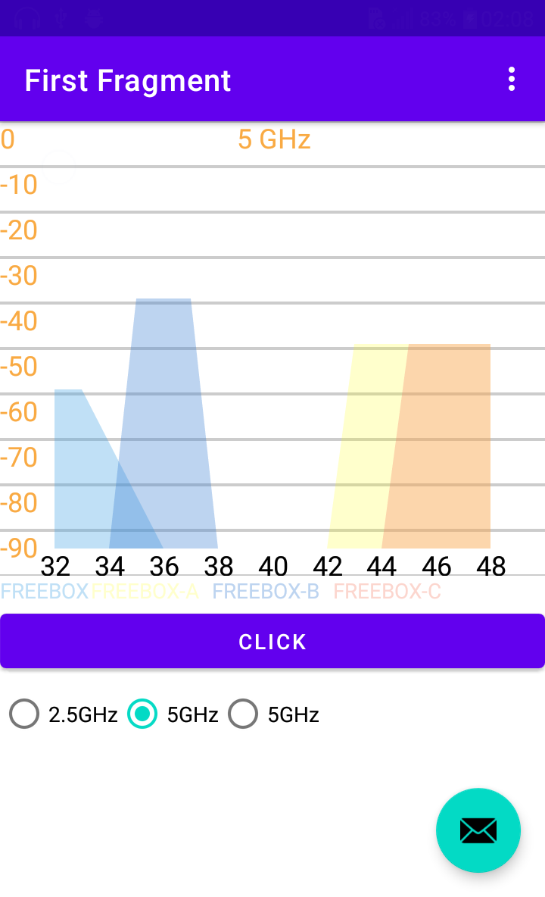
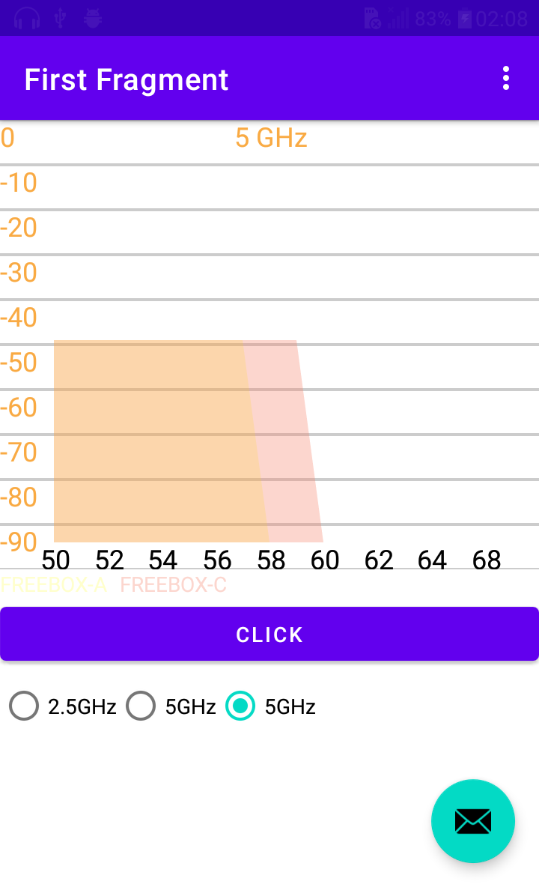
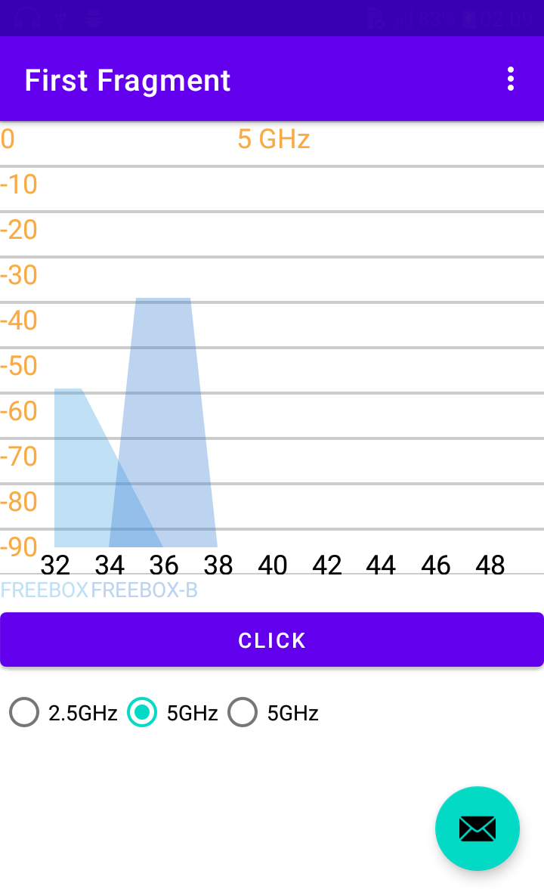

# Wi-Fi Channel Graph Android
Wi-Fi Trapezoidal Channel Graphs Made with Kotlin

You can set your own color or you can generate random colors with ColorGenerator.

With the GetActiveChannels function, you can find the channel ranges by passing the Wi-Fi channel width type and channel frequency value.

With the FrequencyToChannel function, you can find the channel by passing the Wi-Fi channelFrequency value.

[](https://jitpack.io/#vidarrrr/Wi-Fi-Channel-Graph/1.0.0)

# Example Code 

```
            <com.graph.wifi.signal.ui.ChannelRouterGraph
                android:layout_width="match_parent"
                android:layout_height="300dp"
                app:layout_constraintTop_toTopOf="parent"
                android:id="@+id/cg"/>
        
```

```
            val colorGenerator = ColorGenerator()
            val firstChannels = getActiveChannels(ScanResult.CHANNEL_WIDTH_40MHZ,5160)
            val secondChannels = getActiveChannels(ScanResult.CHANNEL_WIDTH_80MHZ_PLUS_MHZ,5250)
            val secondChannels2 = getActiveChannels(ScanResult.CHANNEL_WIDTH_80MHZ_PLUS_MHZ,5200)
            val thirdChannels = getActiveChannels(ScanResult.CHANNEL_WIDTH_20MHZ,5180)
            val fourthChannels = getActiveChannels(ScanResult.CHANNEL_WIDTH_80MHZ,5260)
            val fifthChannels = getActiveChannels(ScanResult.CHANNEL_WIDTH_20MHZ,2417)
            val sixthChannels = getActiveChannels(ScanResult.CHANNEL_WIDTH_80MHZ,2447)
            val seventhChannels = getActiveChannels(ScanResult.CHANNEL_WIDTH_40MHZ,2447)

            binding.cg.start(
                ChannelConstants._2ghz,
                listOf(
                    WiFiGraph(
                        "FREEBOX",
                        32,
                        Color.parseColor(colorGenerator.generateColor()), //"#33FFAA00"
                        firstChannels,//listOf(30, 32, 34),
                        SignalLevel.getSignalLevel(-59)
                    ),
                    WiFiGraph(
                        "FREEBOX-A",
                        50,
                        Color.parseColor("#33FFFF00"),
                        secondChannels,//listOf(42, 44, 46, 48, 50, 52, 54,56),
                        SignalLevel.getSignalLevel(-49)
                    ),
                    WiFiGraph(
                        "FREEBOX-B",
                        36,
                        Color.parseColor(colorGenerator.generateColor()),
                        thirdChannels,//listOf(34, 36, 38),
                        SignalLevel.getSignalLevel(-39)
                    ),
                    WiFiGraph(
                        "FREEBOX-C",
                        52,
                        Color.parseColor(colorGenerator.generateColor()),
                        fourthChannels,//listOf(46, 48, 50, 52, 54,56),
                        SignalLevel.getSignalLevel(-49)
                    ),
                    WiFiGraph(
                        "FREEBOX",
			FrequencyToChannel.intChannel(2417),
                        Color.parseColor(colorGenerator.generateColor()), //"#33FFAA00"
                        fifthChannels,
                        SignalLevel.getSignalLevel(-59)
                    ),
                    WiFiGraph(
                        "FREEBOX",
                        6,
                        Color.parseColor("#33FFFF00"),
                        sixthChannels,
                        SignalLevel.getSignalLevel(-49)
                    ),
                    WiFiGraph(
                        "FREEBOX",
                        6,
                        Color.parseColor(colorGenerator.generateColor()),
                        seventhChannels,
                        SignalLevel.getSignalLevel(-39)
                    )
                ),
                ChannelConstants._2ghzChannels
            )

            binding.cg.setOnSSIDWithColor {
                binding.text1.text = ""
                for (i in binding.cg.ssidWithColors) {
                    val spannableString = SpannableString(i.ssid + "\t")
                    spannableString.setSpan(
                        ForegroundColorSpan(i.color),
                        0,
                        spannableString.length,
                        0
                    )
                    binding.text1.append(spannableString)
                }
            }
            var clicked = false
            binding.buttonChanger.setOnClickListener {
                clicked = if(clicked){
                    binding.cg.setOnlyShowPositions(listOf(0,2)){

                    }
                    false
                }else{
                    binding.cg.setOnlyShowPositions(listOf()){

                    }
                    true
                }
            }
            binding.radioGroup.setOnCheckedChangeListener { _, checkedId ->
                when (checkedId) {
                    R.id.two_ghz -> {
                        binding.cg.setChannels(ChannelConstants._2ghzChannels)
                        binding.cg.setChannelName(ChannelConstants._2ghz)
                    }
                    R.id.five_ghz -> {
                        binding.cg.setChannels(ChannelConstants._5ghzChannels1)
                        binding.cg.setChannelName(ChannelConstants._5ghz)
                    }
                    else -> {
                        binding.cg.setChannels(ChannelConstants._5ghzChannels2)
                        binding.cg.setChannelName(ChannelConstants._5ghz)
                    }
                }

            }
           
```

1. You need to call the initialization function.
2. To show only the selected graphics, you should assign their positions to the setOnlyShowPositions function.
3. You can change the chart channel range with setChannels.
4. You can change the name of the chart channels with setChannelName.
5. You can get and display all SSIDs in ssidWithColors in color with the notification from the setOnSSIDWithColor function after the graph is drawn.

# ScreenShots






# Download

Add it in your root build.gradle at the end of repositories:

```
allprojects {
		repositories {
			...
			maven { url 'https://jitpack.io' }
		}
	}
 ```
 
 Step 2. Add the dependency
 
 ```
 dependencies {
	        implementation 'com.github.vidarrrr:Wi-Fi-Channel-Graph:1.0.0'
	}
 ```

# License

Apache License 2.0

